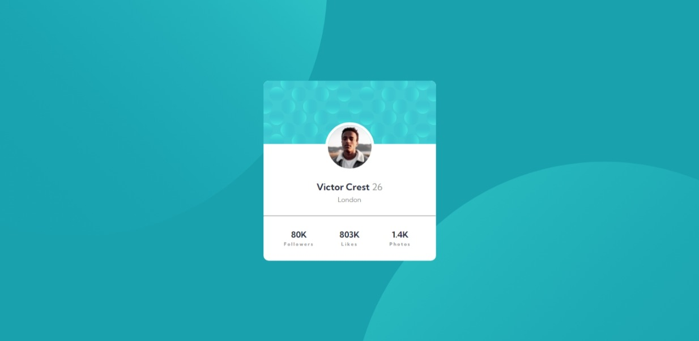

# Frontend Mentor - Profile card component solution

This is a solution to the [Profile card component challenge on Frontend Mentor](https://www.frontendmentor.io/challenges/profile-card-component-cfArpWshJ). Frontend Mentor challenges help you improve your coding skills by building realistic projects. 

## Table of contents

- [Overview](#overview)
  - [The challenge](#the-challenge)
  - [Screenshot](#screenshot)
  - [Links](#links)
- [My process](#my-process)
  - [Built with](#built-with)
  - [What I learned](#what-i-learned)
  - [Useful resources](#useful-resources)
- [Author](#author)

## Overview

### The challenge

- Build out the project to the designs provided

### Screenshot



### Links

- Solution URL: [Add solution URL here](https://github.com/saulgutierrez/profile-card-component-main)
- Live Site URL: [Add live site URL here](https://stalwart-paprenjak-cca7e9.netlify.app/)

## My process

### Built with

- Semantic HTML5 markup
- CSS custom properties
- Flexbox

### What I learned

Set two images as background and pin them to the screen:

```css
.proud-of-this-css {
  background-image: url('images/bg-pattern-bottom.svg'), url('images/bg-pattern-top.svg');
  background-position: 180% -100%, -90% 165%;
  background-repeat: no-repeat, no-repeat;
}
```


### Useful resources

- [mdn web docs](https://developer.mozilla.org/en-US/docs/Web/CSS) - Documentation site and guides for HTML, CSS and JS.

## Author

- Website - [Saúl Gutiérrez](https://sauladai.netlify.app/)
- Frontend Mentor - [@saulgutierrez](https://www.frontendmentor.io/profile/saulgutierrez)